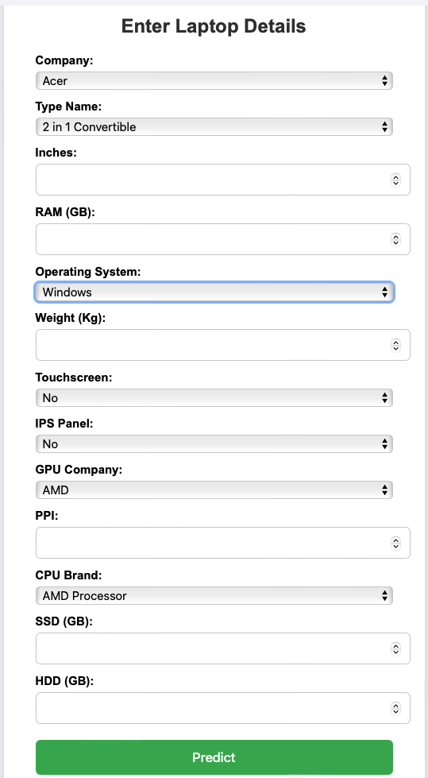

# 💻 Laptop Price Analysis ML Project

A Flask web application that predicts **laptop prices** based on various specifications using a trained machine learning pipeline.

---

## **Table of Contents**
- [About](#about)
- [Features](#features)
- [Dataset](#dataset)
- [Installation](#installation)
- [Usage](#usage)
- [Deployment](#deployment)
- [Technologies](#technologies)


---

## **About**
This project predicts the price of a laptop based on features like **brand, type, RAM, storage, screen size, CPU, GPU**, and more. It uses a **scikit-learn pipeline** to preprocess the data and make predictions, wrapped in a **Flask web application** for easy interaction.

---

## **Features**
- Predict laptop price from user input.
- User-friendly **HTML form** for input.
- Preprocessing with **OneHotEncoding** for categorical features and scaling for numerical features.
- Uses a trained **Random Forest / Decision Tree model** (pipeline saved with `pickle`).

---

## **Dataset**
The dataset includes features like:
- `Company`, `TypeName`, `Inches`, `Ram`, `OS`, `Weight`, `Touchscreen`, `IPSpanel`, `GPU_company`, `PPI`, `Cpu_Brand`, `SSD`, `HDD`, `Price`.

---

## **Installation**

1. **Clone the repository**
```bash
git clone https://github.com/<your-username>/LaptopPriceAnalysis_ML_Project.git
cd LaptopPriceAnalysis_ML_Project
Create virtual environment
python3 -m venv venv
source venv/bin/activate   # For Linux/macOS
## Install dependencies
pip install -r requirements.txt
```

## **Usage
Run the Flask app:
python app.py
Open a browser and go to:
http://3.87.246.21:8000:8000
Enter laptop specifications and click Predict to see the estimated price.

## **Deployment
This project can be deployed on:
AWS EC2 using a public IP and custom TCP port.
 
## **Technologies
Python 3
Flask
Pandas, NumPy
scikit-learn
Bootstrap 5 for frontend
AWS EC2 for deployment

## Screenshots

